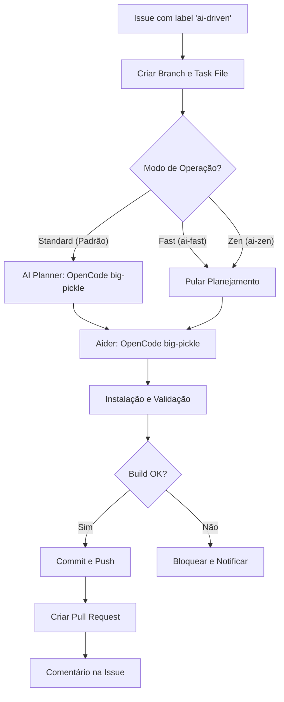

# Fluxo de Desenvolvimento Dirigido por IA (AI-Driven)

Este workflow automatiza a resolução de Issues no GitHub usando a API do **OpenCode (Zen)** com o modelo **big-pickle** e a ferramenta Aider.

## Fluxo de Execução

## Modos de Operação

- **Standard**: Usa o endpoint do OpenCode com o modelo `big-pickle` para criar um plano de implementação detalhado antes das mudanças.
- **Fast (`ai-fast`)**: Pula etapa de planejamento para rapidez. Timeout curto (2 min).
- **Zen (`ai-zen`)**: Pula planejamento. Timeout longo (20 min) para tarefas complexas.

## Detalhes Técnicos e Autenticação

- **Aider**: Configurado via variáveis de ambiente globais para garantir compatibilidade:
  - `OPENAI_API_KEY`: Recebe o valor de `secrets.OPENCODE_API_KEY`.
  - `OPENAI_API_BASE`: Definido como `https://opencode.ai/zen/v1`.
- **Modelos**: 
  - `openai/big-pickle`: Modelo usado no Aider (prefixo necessário para forçar o adapter da OpenAI).
  - `big-pickle`: Modelo usado no Planner via curl.
- **Segredos**: Requer `OPENCODE_API_KEY` configurado nos Secrets do repositório.
- **Validação**: O workflow agora verifica se o plano do Planner foi gerado corretamente antes de prosseguir para o Aider.
