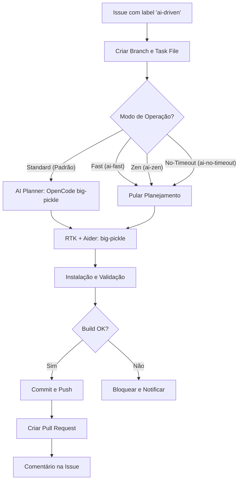

# Fluxo de Desenvolvimento Dirigido por IA (AI-Driven)

Este workflow automatiza a resolução de Issues no GitHub usando a API do **OpenCode (Zen)** com o modelo **big-pickle**, otimizado pelo **RTK** e executado via **Aider**.

## Fluxo de Execução

## Modos de Operação

- **Standard**: Planejamento detalhado + Execução (Timeout: 4 min).
- **Fast (`ai-fast`)**: Sem planejamento, execução rápida (Timeout: 2 min).
- **Zen (`ai-zen`)**: Sem planejamento, focado em tarefas complexas (Timeout: 20 min).
- **No-Timeout (`ai-no-timeout`)**: Desativa limites curtos (Limite máximo: 6h - restrição do GitHub).

## Componentes e Otimização

- **RTK (Token Optimizer)**: Proxy que filtra e comprime saídas de comandos (git, ls, cat) para economizar contexto e melhorar a precisão da IA.
- **Aider**: Configurado com `OPENAI_API_BASE=https://opencode.ai/zen/v1` e prefixo `openai/big-pickle`.
- **Relatórios**: O workflow gera um resumo de "Token Savings" (RTK Gain) no final de cada execução.

## Autenticação

- Requer `OPENCODE_API_KEY` nos Secrets do repositório.
- Internamente mapeado para `OPENAI_API_KEY` para compatibilidade com Aider/RTK.
