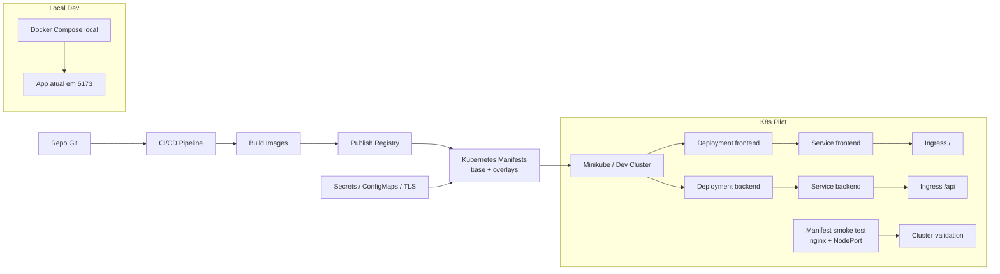

```mermaid
flowchart LR
    A[Repo Git] --> B[CI/CD Pipeline]
    B --> C[Build Images]
    C --> D[Publish Registry]
    D --> E[Kubernetes Manifests<br/>base + overlays]
    E --> F[Minikube / Dev Cluster]
    F --> G[Deployment frontend]
    F --> H[Deployment backend]
    G --> I[Service frontend]
    H --> J[Service backend]
    I --> K[Ingress /]
    J --> L[Ingress /api]
    M[Docker Compose local] --> N[App atual em 5173]
    O[Manifest smoke test<br/>nginx + NodePort] --> P[Cluster validation]
    Q[Secrets / ConfigMaps / TLS] --> E

    subgraph Local Dev
        M
        N
    end

    subgraph K8s Pilot
        F
        G
        H
        I
        J
        K
        L
        O
        P
    end
```
